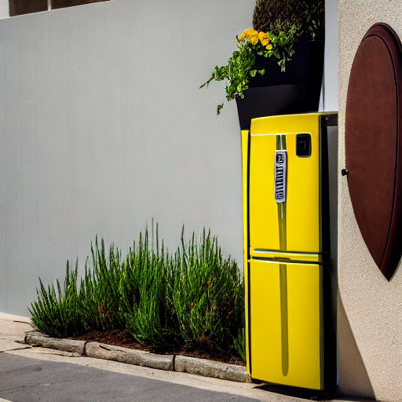
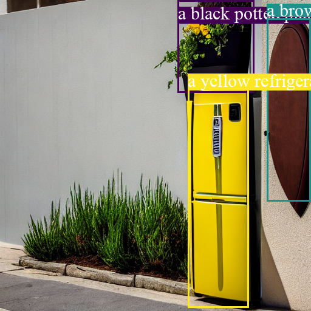

# MIGC-diffusers

A diffusers-compatible implementation of **MIGC** (Multi-Instance Generation with Context-aware Spatial Attention), enabling layout-guided text-to-image generation with precise spatial control over object placement.

The major modification from the original MIGC implementation is the **pre-converted adapter checkpoint keys** to be compatible with the Hugging Face Diffusers library.

**Note**: This is an unofficial implementation adapting MIGC for the Diffusers ecosystem. For the original implementation and research, please refer to the [original MIGC repository](https://github.com/limuloo/MIGC).

## 🎯 Quick Start

```bash
git clone https://github.com/yourusername/MIGC-diffusers.git
cd MIGC-diffusers

uv sync
source .venv/bin/activate

python demo.py
```

The demo inference will generate an image based on the prompt and bounding boxes defined in `demo.py`.

<p align="center">
  
  
</p>

## ✉️ Contact us

If you have any questions, feel free to contact me at wooyeol0519@snu.ac.kr

## 🙏 Acknowledgments

This work is based on original research and code by [limuloo] at [MIGC](https://github.com/limuloo/MIGC), [stable diffusion](https://arxiv.org/abs/2304.08818), and [diffusers](https://github.com/huggingface/diffusers/) library by Hugging Face.
